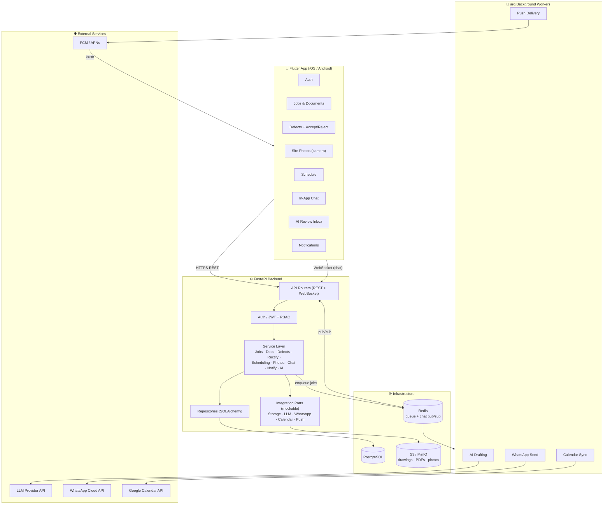
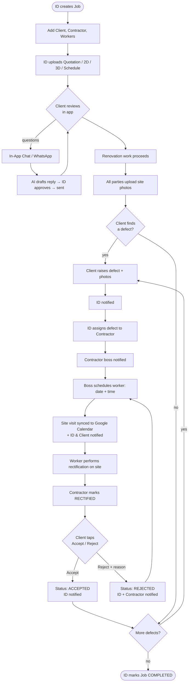
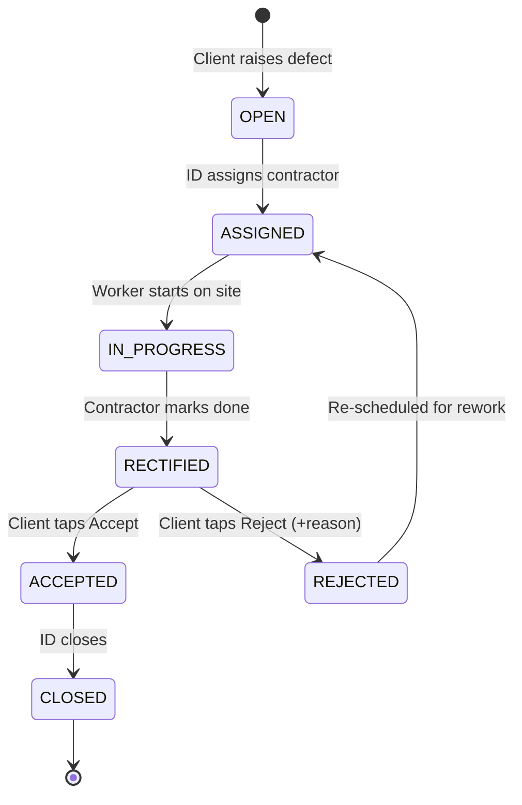
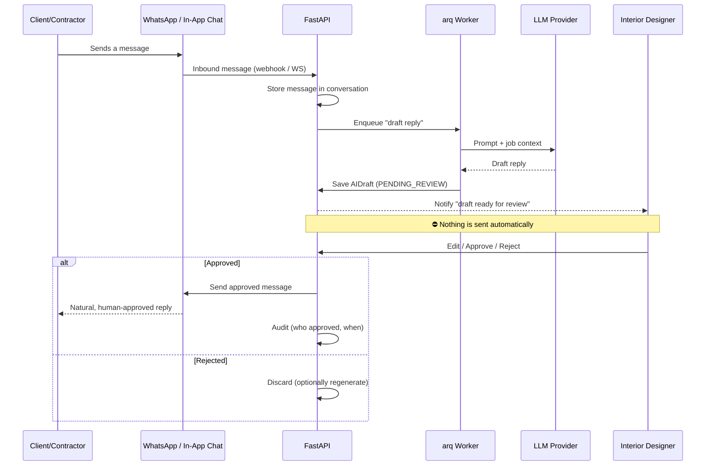
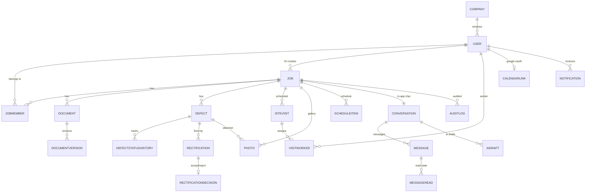
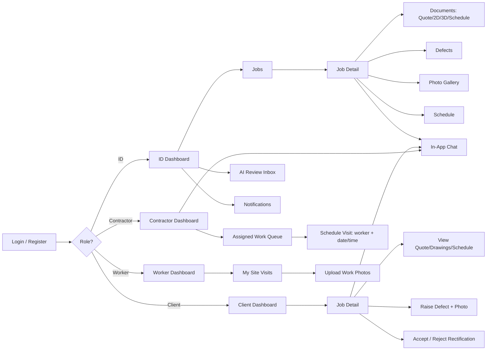

# ID Job-Site Platform — Visual Workflow & App Design

Diagrams are written in **Mermaid**. They render automatically on GitHub and in any
Mermaid-capable viewer. A rendered PNG/SVG export is also saved alongside this file
(`architecture.svg`, `workflow.svg`) once generated.

---

## 1. System Architecture

---

## 2. End-to-End Workflow (renovation lifecycle)

---

## 3. Defect & Rectification State Machine

---

## 4. Agentic AI — Human-in-the-Loop (never auto-sends)

---

## 5. Data Model (ERD)

---

## 6. Flutter App — Screen Map (by role)

